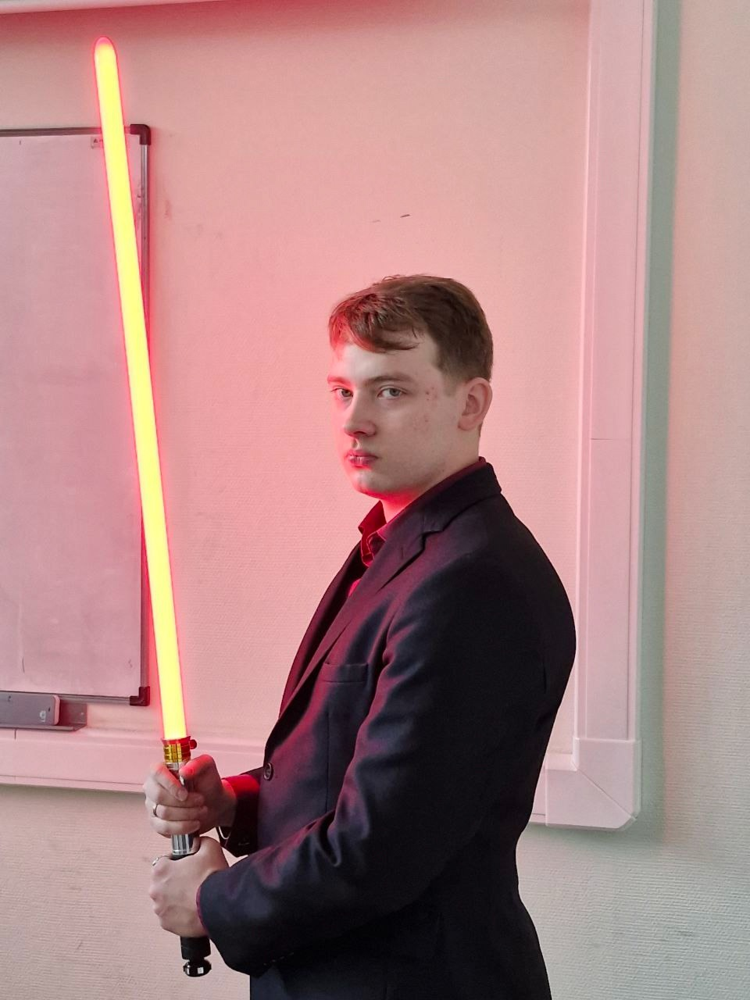

# Информация о дисциплине

Репозиторий представляет материалы по дисциплине ***Проектирование интеллектуальных систем, часть вторая***, прочитанной в ****2025** году кафедрой ***Вычислительной техники (ВТ)***.

Курс лекций провёл
***Сорокин Алексей Борисович***,
кандидат технических наук, доцент кафедры вычислительной техники,
лауреат звания «Преподаватель года».

  
   
  <strong>Рисунок 1 - Сорокин Алексей Борисович</strong>

Практические занятия курса провёл
***Холмогоров Владислав Владиславович***,
практикующий специалист в области машинного обучения и нейронных сетей.

  
   
  <strong>Рисунок 2 - Холмогоров Владислав Владиславович</strong>

В папке ***Лекции*** находятся pdf-файлы лекций курса. Для каждой практической работы создана отдельная папка. Отчеты по практическим работам доступны в форматах ***.docx*** и ***.pdf***.

## Практическая работа №1

Нечёткие отношения.

## Практическая работа №2

Нечёткое управление.

## Практическая работа №3

Обучение с подкреплением на основе модели.

## Практическая работа №4

Обучение с подкреплением без модели.

## Практическая работа №5

Многоагентные системы.

## Практическая работа №6

Генетические алгоритмы.